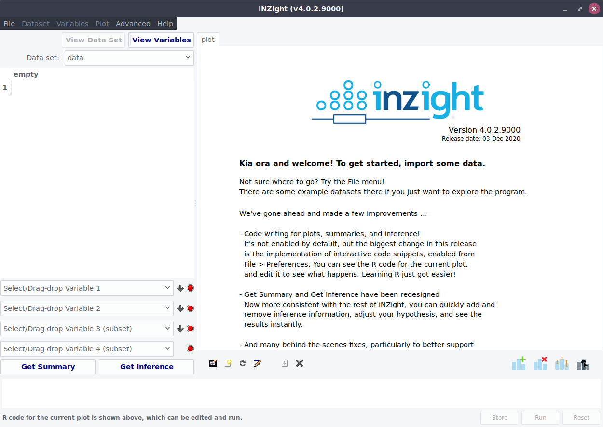

# iNZight

* developed by statistics students at UoA
* used in teaching NCEA L3 and undergraduate university courses
* also used in (non-) government organisations around the world
* built with R (also developed here at the Department of Statistics)

# Intuitive Interface

* users choose variables, not methods
* makes it easier to learn *and* re-learn later on
* focus on exploration and developing intuition for data

{.size-800}

# Automatic Graphs

* **iNZight** chooses the appropriate graph to display the chosen variables
* easy to customise color and size, add lines or smoothers
* textual summaries with the click of a button

# Data Wrangling

* imports a range of formats, including from other software
    * Excel, SAS, stata, SPSS, ...
* collection of transformations to do common data wrangling processes
* supports numeric, categorical, and date/time variable formats natively

# Advanced Modules

* model fitting to fit regression models
* maps for plotting geographical data
* time series for exploring and forecasting data over time
* ... and more ...
